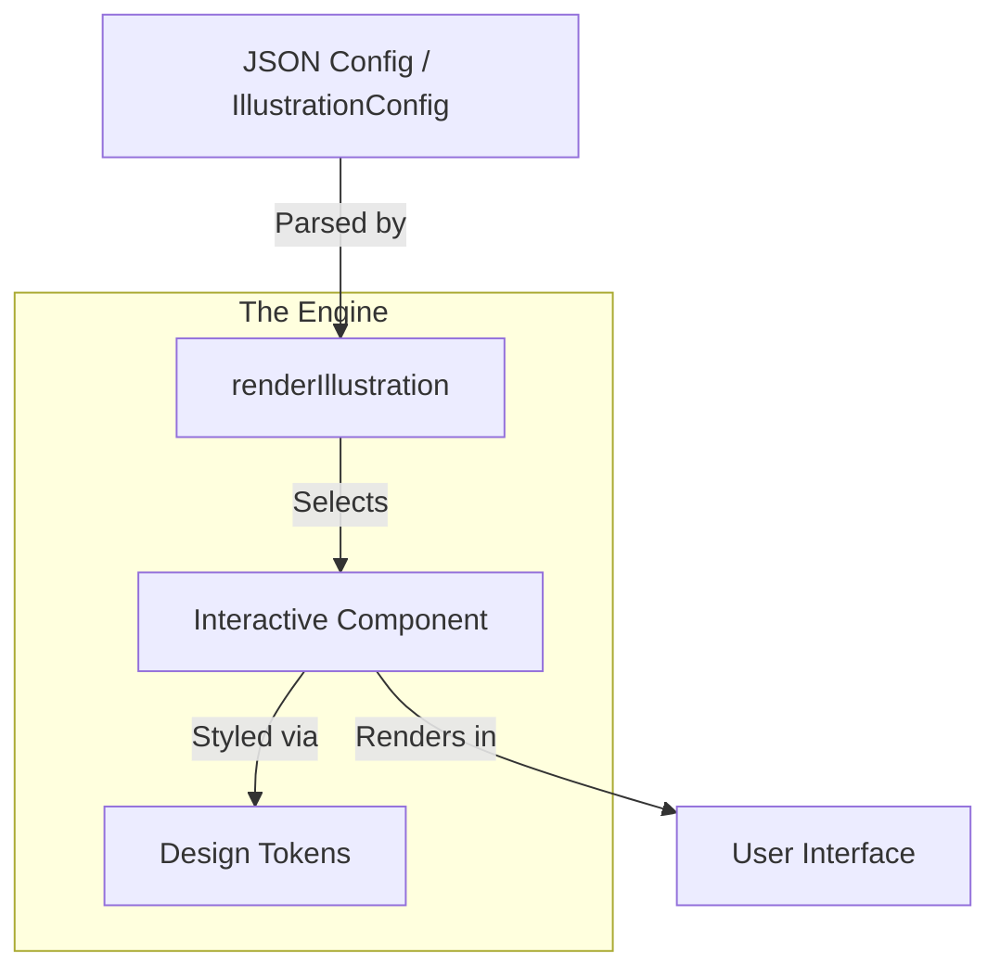

# 🎭 StepWise Interactive Engine

> The "Visual Language" of StepWise. A collection of highly reusable, premium React components designed for multi-sensory educational experiences.

The Interactive Engine bridges the gap between abstract code concepts and clear visual mental models. It turns static documentation into "lived" experiences where users can touch, drag, and simulate the concepts they are learning.

---

## 🏗 Architecture: Data-Driven Immersion

The engine follows a **Strict Data-to-UI** pattern. Content creators define the *state* of an illustration using a plain JSON object (`IllustrationConfig`), and the engine handles the rendering, animations, and interactive logic.



---

## 🚀 Quick Start for New Developers

### Adding Interactive Components to Steps/Quests

1. **Import the Engine** in your lesson content:
```typescript
import { renderIllustration } from "@repo/interactive-engine";
import type { IllustrationConfig } from "@repo/interactive-engine";
```

2. **Create a Configuration** in your `slide-configs.ts`:
```typescript
export const MY_SLIDE_CONFIGS: Record<string, IllustrationConfig> = {
  "my-step-id": {
    type: "GitCommitGraph",
    hint: "Click commits to see details",
    commits: [
      { id: "a1b2", message: "Initial commit", branch: "main" },
      { id: "c3d4", message: "Add feature", branch: "feature" }
    ]
  }
};
```

3. **Use in React Components**:
```tsx
import { renderIllustration } from "@repo/interactive-engine";
import { MY_SLIDE_CONFIGS } from "./slide-configs";

export function MyStep() {
  const config = MY_SLIDE_CONFIGS["my-step-id"];
  return renderIllustration(config);
}
```

---

## 📚 Component Reference Guide

### 🔗 Git & Source Control Components

#### **GitCommitGraph**
Visualizes Git commit history as an interactive directed acyclic graph (DAG).

**Visual Appearance:**
```
main:     ○───○───○ (HEAD)
               │
feature:       └─────○
```
- Circles represent commits
- Lines show parent-child relationships
- Branch names are color-coded lanes
- HEAD pointer shows current position
- Click commits to reveal details

**Input Structure:**
```typescript
interface GitCommitGraphConfig {
  type: "GitCommitGraph";
  commits: CommitNode[];
  branches?: GitBranchLine[];
  hint?: string;        // Instructional text shown above
  tip?: string;         // Help text shown below
}

interface CommitNode {
  id: string;           // Short commit hash (e.g., "a1b2")
  message: string;      // Commit message
  branch: string;       // Branch name for grouping
  color?: string;       // Custom background color
  border?: string;      // Custom border color
  isHead?: boolean;     // Shows "HEAD" badge
  detail?: string;      // Revealed content on click
}

interface GitBranchLine {
  name: string;         // Branch name
  color: string;        // Branch color
  commits: string[];    // Array of commit IDs in this branch
}
```

**Usage Example:**
```typescript
{
  type: "GitCommitGraph",
  hint: "Explore the commit history - click any commit for details",
  tip: "Branches are shown as colored lanes",
  commits: [
    {
      id: "a1b2",
      message: "Initial commit",
      branch: "main",
      isHead: true,
      detail: "This is where we started our project"
    },
    {
      id: "c3d4",
      message: "Add user authentication",
      branch: "main",
      detail: "Added login and signup functionality"
    },
    {
      id: "e5f6",
      message: "Implement dark mode",
      branch: "feature/dark-mode",
      detail: "Added theme switching capability"
    }
  ],
  branches: [
    {
      name: "main",
      color: "#10b981",
      commits: ["a1b2", "c3d4"]
    },
    {
      name: "feature/dark-mode",
      color: "#6366f1",
      commits: ["a1b2", "e5f6"]
    }
  ]
}
```

**Best For:** Teaching Git history, branching concepts, merge visualization.

---

#### **GitStagingArea**
Shows Git's three-zone architecture: Working Directory → Staging Area → Repository.

**Visual Appearance:**
```
Working Directory          Staging Area          Repository
├── 📄 file1.txt          ├── (empty)           ├── (empty)
├── 📄 file2.js           │                     │
└── 📄 file3.md           │                     │

Commands:
git add file1.txt    →    git commit -m "msg"    →
```

**Input Structure:**
```typescript
interface GitStagingAreaConfig {
  type: "GitStagingArea";
  files: StagingFile[];
  hint?: string;
  tip?: string;
  interactive?: boolean;  // Allow drag-and-drop
}

interface StagingFile {
  name: string;           // Filename
  status: "modified" | "new" | "deleted";
  staged: boolean;        // Is in staging area?
  committed: boolean;     // Is in repository?
}
```

**Usage Example:**
```typescript
{
  type: "GitStagingArea",
  hint: "Drag files to stage them, then commit",
  tip: "Files must be staged before committing",
  interactive: true,
  files: [
    { name: "index.html", status: "modified", staged: false, committed: true },
    { name: "style.css", status: "new", staged: false, committed: false },
    { name: "script.js", status: "modified", staged: true, committed: false }
  ]
}
```

**Best For:** Teaching Git staging workflow, file status concepts.

---

### 🕹 Simulation & Flow Components

#### **StepSimulator**
Animates message passing between multiple actors in sequence.

**Visual Appearance:**
```
👤 User           👨‍💼 Manager          🤖 Worker
   │                  │                   │
   ├───Request───────▶│                   │
   │                   ├───Process───────▶│
   │                   │◀───Response──────┤
   │◀───Result────────────────────────────┘
```

**Input Structure:**
```typescript
interface StepSimulatorConfig {
  type: "StepSimulator";
  actors: SimActor[];
  steps: SimStep[];
  hint?: string;
  startLabel?: string;     // Default: "▶ Start"
  nextLabel?: string;      // Default: "→ Next"
  doneMessage?: string;    // Shown when complete
  replayLabel?: string;    // Default: "🔄 Replay"
}

interface SimActor {
  icon: string;            // Emoji or icon
  label: string;           // Actor name
  sublabel: string;        // Description
  color: string;           // Background color
  border: string;          // Border color
  isManager?: boolean;     // Glows during simulation
}

interface SimStep {
  from: string;            // Source actor label
  to: string;              // Target actor label
  action: string;          // Action description
}
```

**Usage Example:**
```typescript
{
  type: "StepSimulator",
  hint: "Watch how a web request flows through the system",
  startLabel: "▶ Send Request",
  doneMessage: "✅ Request complete! Data returned to user.",
  actors: [
    {
      icon: "👤",
      label: "Browser",
      sublabel: "User's web browser",
      color: "rgba(99,102,241,0.1)",
      border: "rgba(99,102,241,0.5)"
    },
    {
      icon: "🌐",
      label: "Server",
      sublabel: "Web application server",
      color: "rgba(34,197,94,0.1)",
      border: "rgba(34,197,94,0.5)",
      isManager: true
    },
    {
      icon: "🗄️",
      label: "Database",
      sublabel: "Data storage system",
      color: "rgba(245,158,11,0.1)",
      border: "rgba(245,158,11,0.5)"
    }
  ],
  steps: [
    { from: "Browser", to: "Server", action: "Send HTTP request" },
    { from: "Server", to: "Database", action: "Query user data" },
    { from: "Database", to: "Server", action: "Return user profile" },
    { from: "Server", to: "Browser", action: "Send JSON response" }
  ]
}
```

**Best For:** API flows, system architecture, request/response cycles.

---

### 📂 Data & Interaction Components

#### **InteractiveBuckets**
Drag-and-drop interface for categorizing items between two zones.

**Visual Appearance:**
```
📚 Source Zone                    🎯 Target Zone
├── 🍎 Apple                      ├── (empty - drag here)
├── 🍌 Banana                     │
└── 🥕 Carrot                     │
    ↑                              ↑
   Drag items between zones
```

**Input Structure:**
```typescript
interface InteractiveBucketsConfig {
  type: "InteractiveBuckets";
  items: string[];         // Items to categorize
  source: BucketConfig;
  destination: BucketConfig;
  hint?: string;
  destinationTip?: string; // Help text for destination
}

interface BucketConfig {
  label: string;           // Zone title
  icon: string;            // Zone icon
  color: string;           // Background color
  border: string;          // Border color
}
```

**Usage Example:**
```typescript
{
  type: "InteractiveBuckets",
  hint: "Drag fruits to the basket",
  destinationTip: "Drop fruits here to collect them",
  items: ["🍎 Red Apple", "🍌 Banana", "🥕 Carrot", "🍇 Grapes"],
  source: {
    label: "Garden",
    icon: "🌱",
    color: "rgba(34,197,94,0.1)",
    border: "rgba(34,197,94,0.5)"
  },
  destination: {
    label: "Basket",
    icon: "🧺",
    color: "rgba(245,158,11,0.1)",
    border: "rgba(245,158,11,0.5)"
  }
}
```

**Best For:** Categorization tasks, data organization concepts.

---

#### **JourneyFlow**
Vertical roadmap showing sequential steps with optional storage tracking.

**Visual Appearance:**
```
🎯 Goal: Complete Project

1. 📝 Plan Features          → ✅ Completed
2. 💻 Write Code             → 🔄 In Progress
3. 🧪 Test Implementation    → ⏳ Pending
4. 🚀 Deploy to Production   → ⏳ Pending

💾 Storage: Progress saved
```

**Input Structure:**
```typescript
interface JourneyFlowConfig {
  type: "JourneyFlow";
  steps: JourneyStep[];
  hint?: string;
  storeIcon?: string;       // Default: "💾"
  storeLabel?: string;      // Default: "Storage"
  startLabel?: string;      // Default: "▶ Start"
  nextLabel?: string;       // Default: "→ Next"
  replayLabel?: string;     // Default: "🔄 Replay"
}

interface JourneyStep {
  icon: string;             // Step icon
  action: string;           // Action description
  result: string;           // Result message on completion
  color: string;            // Background color
  border: string;           // Border color
}
```

**Usage Example:**
```typescript
{
  type: "JourneyFlow",
  hint: "Follow the software development lifecycle",
  storeLabel: "Git Repository",
  startLabel: "▶ Begin Development",
  steps: [
    {
      icon: "📝",
      action: "Plan Requirements",
      result: "✅ Requirements documented and approved",
      color: "rgba(99,102,241,0.1)",
      border: "rgba(99,102,241,0.5)"
    },
    {
      icon: "💻",
      action: "Implement Features",
      result: "✅ Code written and committed",
      color: "rgba(34,197,94,0.1)",
      border: "rgba(34,197,94,0.5)"
    },
    {
      icon: "🧪",
      action: "Test & Debug",
      result: "✅ All tests passing",
      color: "rgba(245,158,11,0.1)",
      border: "rgba(245,158,11,0.5)"
    },
    {
      icon: "🚀",
      action: "Deploy",
      result: "✅ Application live in production",
      color: "rgba(236,72,153,0.1)",
      border: "rgba(236,72,153,0.5)"
    }
  ]
}
```

**Best For:** Process flows, tutorials, sequential workflows.

---

### 📂 VFS & Data Structures Components

#### **FileNavigator**
Tree view of a simulated file system with expandable directories.

**Visual Appearance:**
```
📁 project/
├── 📁 src/
│   ├── 📄 index.js
│   └── 📄 app.js
├── 📁 tests/
│   └── 📄 app.test.js
├── 📄 package.json
└── 📄 README.md
```

**Input Structure:**
```typescript
interface FileNavigatorConfig {
  type: "FileNavigator";
  tree: FileSystemTree;
  hint?: string;
  rootLabel?: string;      // Default: "Filesystem"
  tip?: string;
}

interface FileSystemTree {
  [path: string]: {
    type: "file" | "dir";
    children?: FileSystemTree;
    content?: string;      // For files
  };
}
```

**Usage Example:**
```typescript
{
  type: "FileNavigator",
  hint: "Explore the project structure",
  tip: "Click folders to expand/collapse",
  rootLabel: "My Project",
  tree: {
    "src": {
      type: "dir",
      children: {
        "index.js": { type: "file", content: "console.log('Hello!');" },
        "components": {
          type: "dir",
          children: {
            "Button.js": { type: "file", content: "// Button component" },
            "Header.js": { type: "file", content: "// Header component" }
          }
        }
      }
    },
    "package.json": {
      type: "file",
      content: '{"name": "my-app", "version": "1.0.0"}'
    },
    "README.md": {
      type: "file",
      content: "# My App\nA simple application."
    }
  }
}
```

**Best For:** File system concepts, project structure visualization.

---

#### **CollapsibleTree**
Generic tree structure for hierarchical data visualization.

**Visual Appearance:**
```
📂 Root
├── 📄 Child 1
├── 📂 Child 2
│   ├── 📄 Grandchild A
│   └── 📄 Grandchild B
└── 📄 Child 3
```

**Input Structure:**
```typescript
interface CollapsibleTreeConfig {
  type: "CollapsibleTree";
  tree: TreeNode;
  hint?: string;
  tip?: string;
  indent?: number;         // Default: 20px
}

interface TreeNode {
  label: string;           // Node display text
  icon?: string;           // Optional icon
  children?: TreeNode[];   // Child nodes
  expanded?: boolean;      // Initially expanded
}
```

**Usage Example:**
```typescript
{
  type: "CollapsibleTree",
  hint: "Explore the data structure",
  tip: "Click items to expand/collapse branches",
  indent: 25,
  tree: {
    label: "Company",
    icon: "🏢",
    expanded: true,
    children: [
      {
        label: "Engineering",
        icon: "💻",
        expanded: true,
        children: [
          { label: "Frontend Team", icon: "🌐" },
          { label: "Backend Team", icon: "⚙️" },
          { label: "DevOps Team", icon: "🚀" }
        ]
      },
      {
        label: "Product",
        icon: "📊",
        children: [
          { label: "Designers", icon: "🎨" },
          { label: "Product Managers", icon: "📋" }
        ]
      }
    ]
  }
}
```

**Best For:** Hierarchical data, organization charts, taxonomy visualization.

---

### 🖱 Interactive Reveal Components

#### **ClickRevealGrid**
Grid of cards that reveal detailed information when clicked.

**Visual Appearance:**
```
┌─────────────┬─────────────┐
│ 🍎 Concept A │ 🍌 Concept B │
│             │             │
│ Click to    │ Click to    │
│ reveal      │ reveal      │
└─────────────┴─────────────┘
```

**Input Structure:**
```typescript
interface ClickRevealGridConfig {
  type: "ClickRevealGrid";
  items: ClickRevealItem[];
  hint?: string;
  columns?: number;        // Default: 3
  detailLabel?: string;    // Header for revealed content
}

interface ClickRevealItem {
  id: string;              // Unique identifier
  icon: string;            // Card icon
  label: string;           // Card title
  detail: string;          // Revealed content
  detailLabel?: string;    // Optional detail header
}
```

**Usage Example:**
```typescript
{
  type: "ClickRevealGrid",
  hint: "Click each concept to learn more",
  columns: 2,
  detailLabel: "Deep Dive:",
  items: [
    {
      id: "git",
      icon: "🔀",
      label: "Version Control",
      detail: "Git tracks changes to files over time, allowing you to revert to previous versions and collaborate with others."
    },
    {
      id: "branching",
      icon: "🌿",
      label: "Branching Strategy",
      detail: "Branches allow parallel development. Main branch stays stable while features are developed separately."
    },
    {
      id: "merge",
      icon: "🔗",
      label: "Merging Changes",
      detail: "Combining branches back together. Git automatically merges compatible changes or flags conflicts for manual resolution."
    },
    {
      id: "remote",
      icon: "☁️",
      label: "Remote Repositories",
      detail: "Cloud-hosted copies of your repository. Enables collaboration and provides backup."
    }
  ]
}
```

**Best For:** Concept introductions, FAQ sections, detailed explanations.

---

#### **ComparePanel**
Side-by-side comparison with optional revealable content.

**Visual Appearance:**
```
📊 Comparison: Good vs Bad Approach

Good Approach          Bad Approach
✅ Clear naming        ❌ Cryptic names
✅ Good comments       ❌ No comments
✅ Error handling      ❌ Ignores errors

[Click to reveal details]
```

**Input Structure:**
```typescript
interface ComparePanelConfig {
  type: "ComparePanel";
  left: CompareSide;
  right: CompareSide;
  hint?: string;
  successMessage?: string;  // Shown after interaction
}

interface CompareSide {
  icon: string;             // Side icon
  title: string;            // Side title
  revealContent?: string[]; // Bullet points (revealed on click)
  color: string;            // Background color
  border: string;           // Border color
  locked?: boolean;         // Initially locked appearance
}
```

**Usage Example:**
```typescript
{
  type: "ComparePanel",
  hint: "Compare these two code organization approaches",
  successMessage: "Great! You can see why modular code is better.",
  left: {
    icon: "✅",
    title: "Modular Code",
    color: "rgba(34,197,94,0.1)",
    border: "rgba(34,197,94,0.5)",
    revealContent: [
      "Each function has a single responsibility",
      "Easy to test individual components",
      "Changes don't break unrelated code",
      "Code is reusable across projects"
    ]
  },
  right: {
    icon: "❌",
    title: "Monolithic Code",
    color: "rgba(239,68,68,0.1)",
    border: "rgba(239,68,68,0.5)",
    revealContent: [
      "One huge function does everything",
      "Hard to debug specific issues",
      "Changes risk breaking everything",
      "Difficult to reuse in other projects"
    ]
  }
}
```

**Best For:** Comparisons, pros/cons analysis, before/after scenarios.

---

#### **ExpandableCardList**
Accordion-style cards that expand to show detailed content.

**Visual Appearance:**
```
▶ Card 1 Title
▶ Card 2 Title
▶ Card 3 Title

[Click any card to expand]
```

**Input Structure:**
```typescript
interface ExpandableCardListConfig {
  type: "ExpandableCardList";
  items: ExpandableCardItem[];
  hint?: string;
  multiOpen?: boolean;      // Allow multiple cards open
}

interface ExpandableCardItem {
  id: string;               // Unique identifier
  icon: string;             // Card icon
  label: string;            // Card title
  reveal: string;           // Content shown when expanded
}
```

**Usage Example:**
```typescript
{
  type: "ExpandableCardList",
  hint: "Click each section to learn more about Git commands",
  multiOpen: true,
  items: [
    {
      id: "init",
      icon: "📁",
      label: "git init",
      reveal: "Creates a new Git repository in the current directory. This command initializes the .git folder that will track all your files and changes."
    },
    {
      id: "add",
      icon: "➕",
      label: "git add",
      reveal: "Stages files for the next commit. You can add specific files or use 'git add .' to stage all modified files. This is like preparing your changes for packaging."
    },
    {
      id: "commit",
      icon: "📦",
      label: "git commit",
      reveal: "Creates a snapshot of your staged changes. Always include a descriptive message with -m flag. This is like taking a photo of your code at this point in time."
    },
    {
      id: "status",
      icon: "🔍",
      label: "git status",
      reveal: "Shows the current state of your working directory and staging area. Tells you what files are modified, staged, or untracked."
    }
  ]
}
```

**Best For:** FAQ sections, detailed command references, progressive disclosure.

---

### 💬 Information & Feedback Components

#### **InfoCallout**
Contextual information display with different variants.

**Visual Appearance:**
```
💡 TIP
Did you know that you can use git log --oneline
for a compact view of commit history?
```

**Input Structure:**
```typescript
interface InfoCalloutConfig {
  type: "InfoCallout";
  text: string;             // Message content
  icon?: string;            // Optional icon override
  variant?: "info" | "warning" | "tip" | "error"; // Default: "info"
}
```

**Usage Example:**
```typescript
{
  type: "InfoCallout",
  text: "Remember to pull changes from remote before pushing your work.",
  icon: "⚠️",
  variant: "warning"
}
```

**Best For:** Tips, warnings, important notes, contextual information.

---

#### **SimulatedTerminal**
Interactive terminal simulation for Git/Linux commands.

**Visual Appearance:**
```
$ git status
On branch main
Your branch is up to date with 'origin/main'.

Changes not staged for commit:
  modified:   index.html

$ █
```

**Input Structure:**
```typescript
interface SimulatedTerminalConfig {
  type: "SimulatedTerminal";
  language?: "git" | "linux";  // Default: "git"
  hint?: string;
  initialVfs?: Record<string, TermVfsNode>; // Initial filesystem
  preHistory?: string[];       // Commands shown as already run
  height?: number;             // Terminal height in pixels
}
```

**Usage Example:**
```typescript
{
  type: "SimulatedTerminal",
  hint: "Try these Git commands in the terminal",
  language: "git",
  height: 300,
  preHistory: [
    "git init",
    "echo 'Hello World' > README.md",
    "git add README.md"
  ],
  initialVfs: {
    "README.md": {
      type: "file",
      content: "Hello World"
    }
  }
}
```

**Best For:** Terminal command practice, Git workflow simulation.

---

#### **Multi**
Container for stacking multiple illustrations vertically.

**Visual Appearance:**
```
[Illustration 1]

[Illustration 2]

[Illustration 3]
```

**Input Structure:**
```typescript
interface MultiConfig {
  type: "Multi";
  illustrations: IllustrationConfig[]; // Array of configs
  gap?: number;                 // Spacing between items (px)
}
```

**Usage Example:**
```typescript
{
  type: "Multi",
  gap: 20,
  illustrations: [
    {
      type: "InfoCallout",
      text: "First, let's understand the problem",
      variant: "info"
    },
    {
      type: "GitCommitGraph",
      commits: [
        { id: "a1", message: "Initial", branch: "main" }
      ]
    },
    {
      type: "StepSimulator",
      actors: [
        { icon: "👤", label: "User", sublabel: "", color: "#eee", border: "#ccc" }
      ],
      steps: [
        { from: "User", to: "User", action: "Think" }
      ]
    }
  ]
}
```

**Best For:** Complex slides combining multiple concepts.

---

## 🛠 Development Workflow

### Adding a New Component

1. **Define Props Interface** in `src/components/YourComponent.tsx`:
```typescript
export interface YourComponentProps {
  title: string;
  items: string[];
  onItemClick?: (item: string) => void;
}
```

2. **Create React Component**:
```tsx
export function YourComponent({ title, items, onItemClick }: YourComponentProps) {
  return (
    <div className="your-component">
      <h3>{title}</h3>
      {items.map(item => (
        <div key={item} onClick={() => onItemClick?.(item)}>
          {item}
        </div>
      ))}
    </div>
  );
}
```

3. **Add to IllustrationConfig** in `src/IllustrationConfig.ts`:
```typescript
export interface YourComponentConfig {
  type: "YourComponent";
  title: string;
  items: string[];
}

export type IllustrationConfig = // ... existing types
  | YourComponentConfig;
```

4. **Register in renderIllustration** in `src/renderIllustration.tsx`:
```typescript
case "YourComponent":
  return <YourComponent {...config} />;
```

5. **Update README** with detailed documentation.

### Integration in Lesson Content

1. **Create slide-configs.ts** in your quest directory:
```typescript
import type { IllustrationConfig } from "@repo/interactive-engine";

export const QUEST_SLIDE_CONFIGS: Record<string, IllustrationConfig> = {
  "step-1": {
    type: "GitCommitGraph",
    hint: "This shows our commit history",
    commits: [/* ... */]
  }
};
```

2. **Use in React Components**:
```tsx
import { renderIllustration } from "@repo/interactive-engine";
import { QUEST_SLIDE_CONFIGS } from "../slide-configs";

export function StepComponent({ stepId }: { stepId: string }) {
  const config = QUEST_SLIDE_CONFIGS[stepId];
  if (!config) return null;

  return (
    <div className="step-content">
      {renderIllustration(config)}
    </div>
  );
}
```

---

## 🎨 Design System

### Colors
- **Success**: `rgba(34,197,94,0.1)` background, `rgba(34,197,94,0.5)` border
- **Warning**: `rgba(245,158,11,0.1)` background, `rgba(245,158,11,0.5)` border
- **Error**: `rgba(239,68,68,0.1)` background, `rgba(239,68,68,0.5)` border
- **Info**: `rgba(99,102,241,0.1)` background, `rgba(99,102,241,0.5)` border
- **Accent**: `rgba(236,72,153,0.1)` background, `rgba(236,72,153,0.5)` border

### Icons
Use emojis or Unicode symbols consistently across components.

### Spacing
- Component padding: `16px`
- Element gaps: `8px` to `24px`
- Border radius: `8px`

---

## 📋 Component Checklist for New Developers

When adding interactive components to steps/quests:

- [ ] Component follows data-driven pattern (JSON config → UI)
- [ ] TypeScript interfaces are complete and documented
- [ ] Component handles empty/null states gracefully
- [ ] Responsive design works on mobile and desktop
- [ ] Accessibility features (keyboard navigation, screen readers)
- [ ] Loading states for async operations
- [ ] Error boundaries for crash prevention
- [ ] Performance optimized (no unnecessary re-renders)
- [ ] Comprehensive README documentation added
- [ ] Usage examples provided in lesson content
- [ ] Tested across different browsers

---

Designed with ❤️ for **StepWise**. Glitch-free, responsive, and visually stunning.