# 🎭 StepWise Interactive Engine

> The "Visual Language" of StepWise. A collection of highly reusable, premium React components designed for multi-sensory educational experiences.

The Interactive Engine bridges the gap between abstract code concepts and clear visual mental models. It turns static documentation into "lived" experiences where users can touch, drag, and simulate the concepts they are learning.

---

## 🏗 Architecture: Data-Driven Immersion

The engine follows a **Strict Data-to-UI** pattern. Content creators define the *state* of an illustration using a plain JSON object (`IllustrationConfig`), and the engine handles the rendering, animations, and interactive logic.

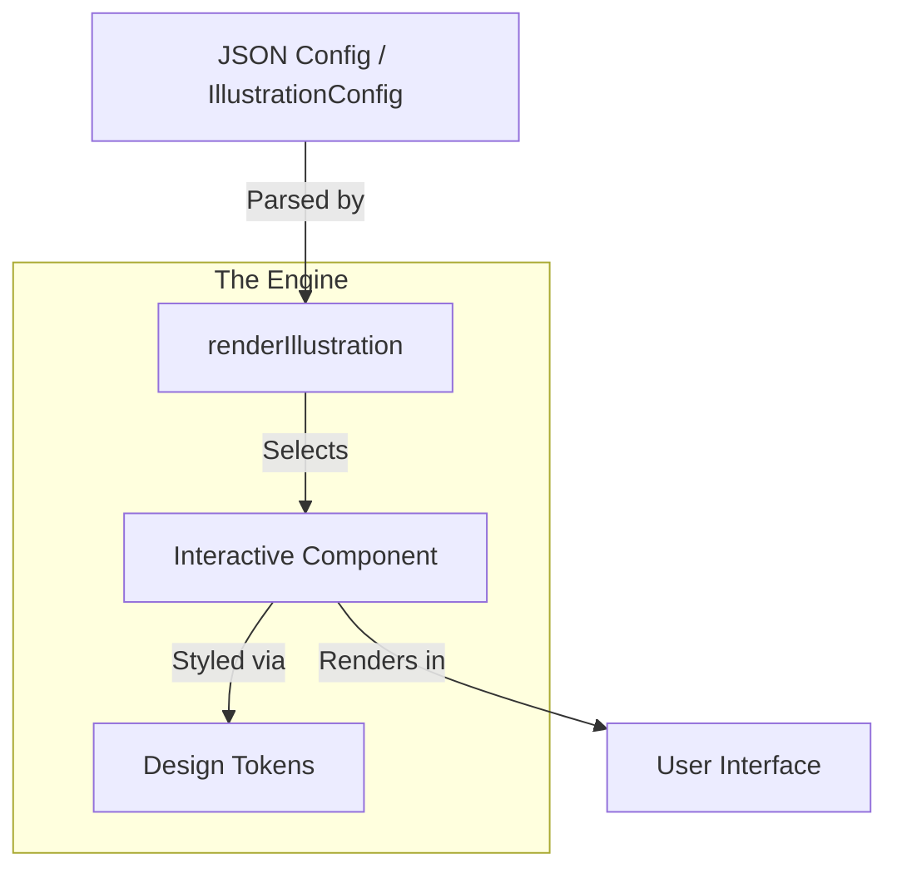

---

## 📚 Visual Dictionary

### 🔗 Git & Source Control
Components designed to make Distributed Version Control intuitive.

| Component | Look & Structure | Input Example |
| :--- | :--- | :--- |
| **GitCommitGraph** | `mermaid graph LR; A((C1)) --- B((C2)); B --- C((C3)); style C fill:#10b981` | `{ type: "GitCommitGraph", commits: [...] }` |
| **GitStagingArea** | `mermaid graph LR; W[Workspace] -->|git add| S[Staging]; S -->|git commit| R[Repo]` | `{ type: "GitStagingArea", files: [...] }` |

#### `GitCommitGraph` Structure
```typescript
interface CommitNode {
  id: string;      // Short hash (e.g., 'a1b2')
  message: string; // Commit message
  branch: string;  // Branch name for lane grouping
  isHead?: boolean;// Shows 'HEAD' badge
  detail?: string; // Revealed on click
}
```

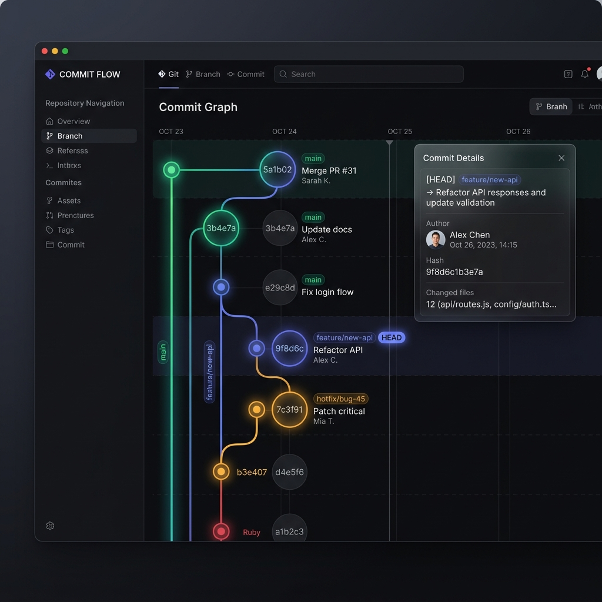

---

#### `GitStagingArea` Structure
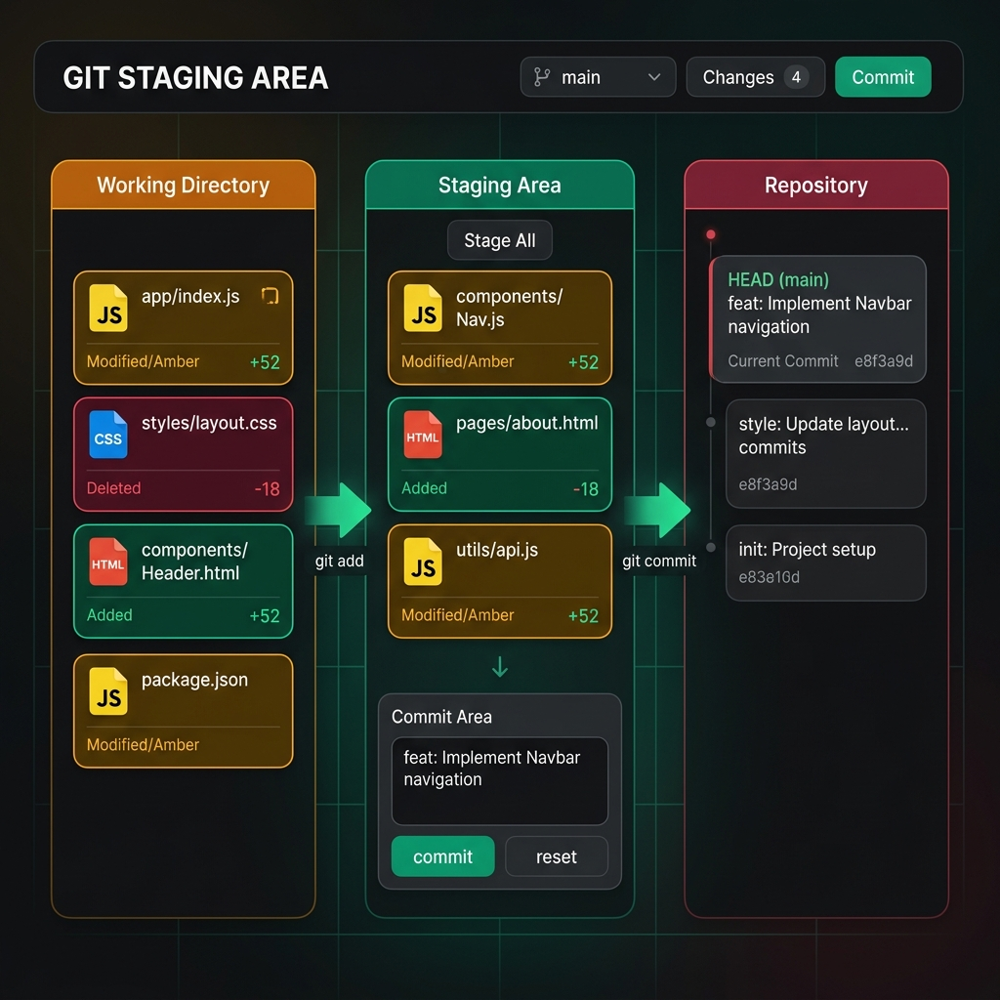

---

### 🕹 Simulation & Flow
Ideal for request/response cycles, OS operations, or step-by-step logic.

#### **StepSimulator**
Visualizes message passing between multiple actors.

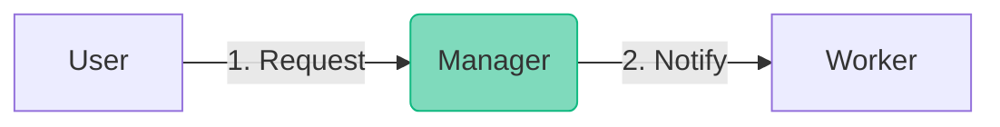

**Input Structure:**
```typescript
interface SimActor {
  icon: string;    // Emoji or SVG
  label: string;   // Actor name
  sublabel: string;// Description
  color: string;   // BG color
  border: string;  // Border color
}

interface SimStep {
  from: string;    // Actor label
  to: string;      // Actor label
  action: string;  // Action text
}
```

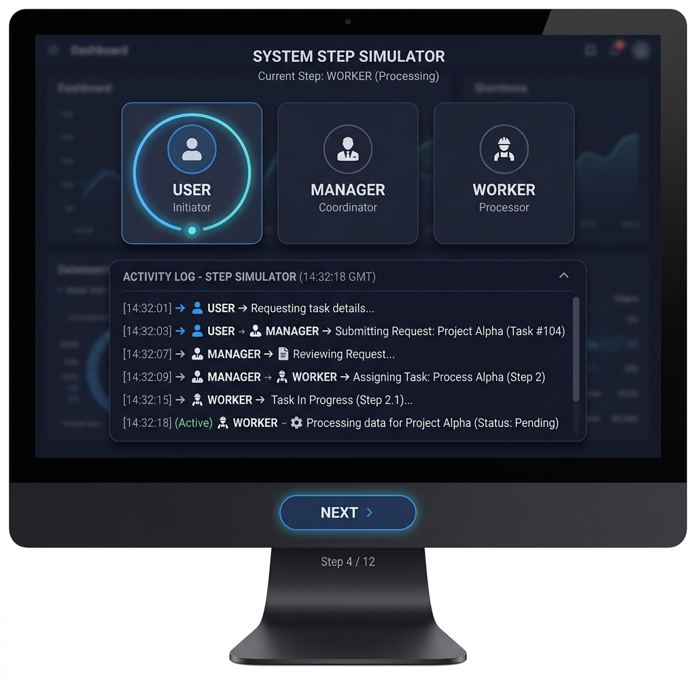

---

### 📂 Data & Interaction
Visualizing how data moves, is stored, or is grouped.

#### **InteractiveBuckets**
Move items between two conceptual zones via direct interaction.

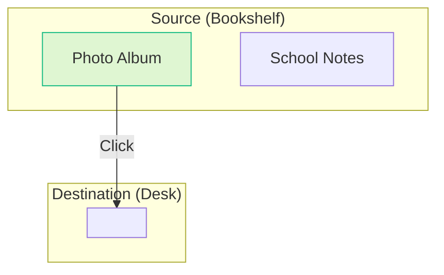

**Input Structure:**
```typescript
interface BucketConfig {
  label: string;
  icon: string;
  color: string;  // BG color (hex or rgba)
  border: string; // Border color
}

interface InteractiveBucketsConfig {
  items: string[];
  source: BucketConfig;
  destination: BucketConfig;
}
```

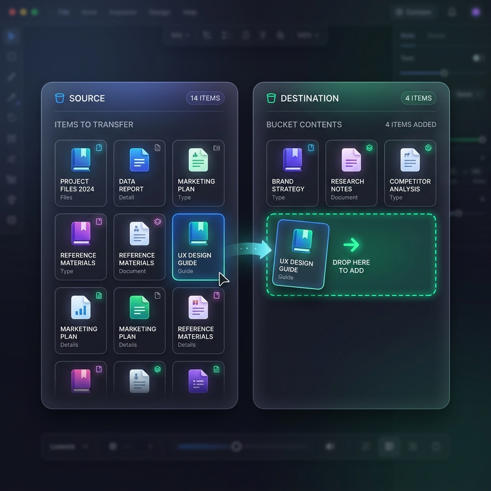

---

#### **JourneyFlow**
A sequential walkthrough of a process, ideally paired with a "permanent store" side-panel.

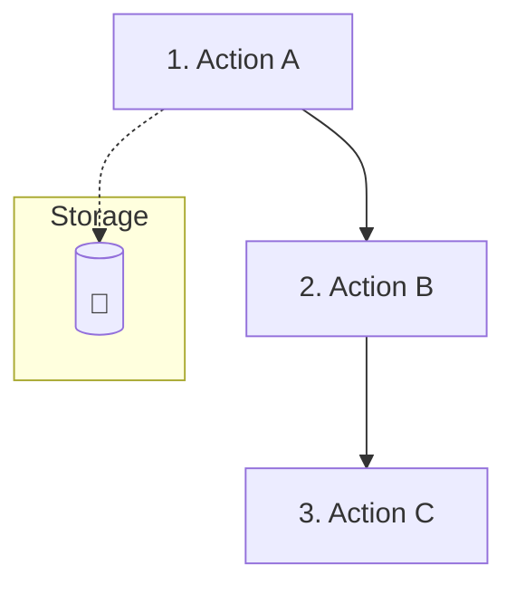

**Input Structure:**
```typescript
interface JourneyStep {
  icon: string;
  action: string;
  result: string; // Message shown when step is reached
  color: string;
  border: string;
}
```

---

### 📂 VFS & Data Structures
Visualizing the invisible state of a file system or structured data.

#### **FileNavigator**
A premium vertical explorer for Simulated File Systems.

```mermaid
graph TD
    R[/root/] --> F1[src]
    R --> F2[package.json]
    F1 --> F11[main.js]
    style R fill:#1e293b,stroke:#334155
```

**Input Structure:**
```typescript
interface FileSystemTree {
  [path: string]: {
    type: 'file' | 'dir';
    children?: FileSystemTree;
    content?: string;
  }
}
```

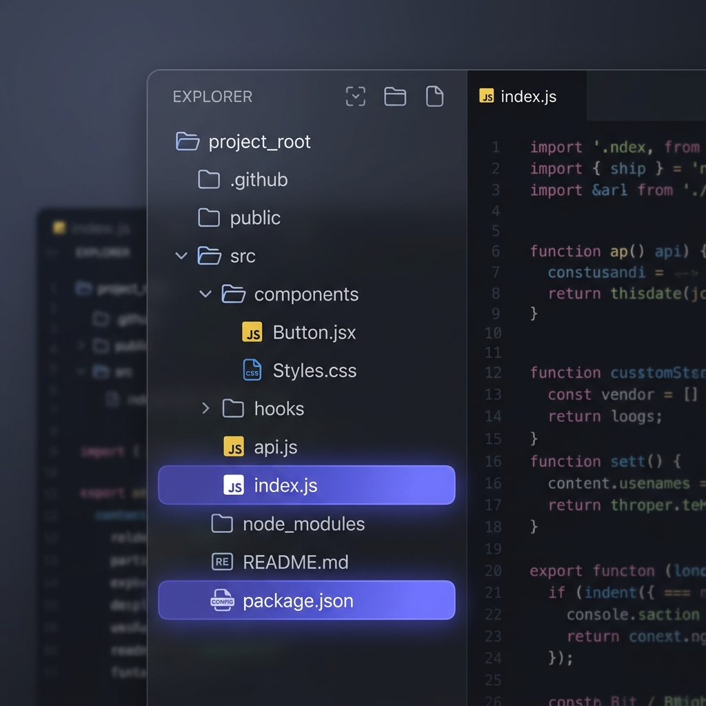

---

### 🖱 Interactive Reveal
Engagement tools for terminology and comparison.

#### **ClickRevealGrid**
A grid of cards that reveal deep-dives on interaction.

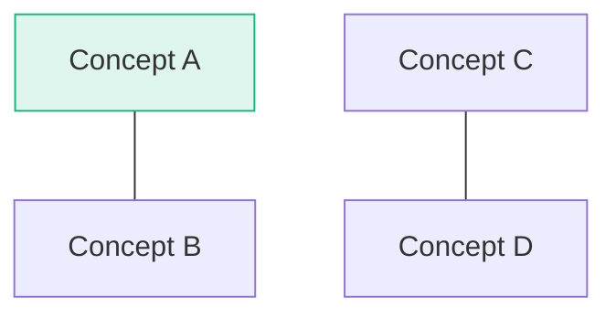

**Input Structure:**
```typescript
interface ClickRevealItem {
  id: string;
  icon: string;
  label: string;
  detail: string;      // The "secret" revealed on click
  detailLabel?: string;// Optional header for the detail pod
}
```

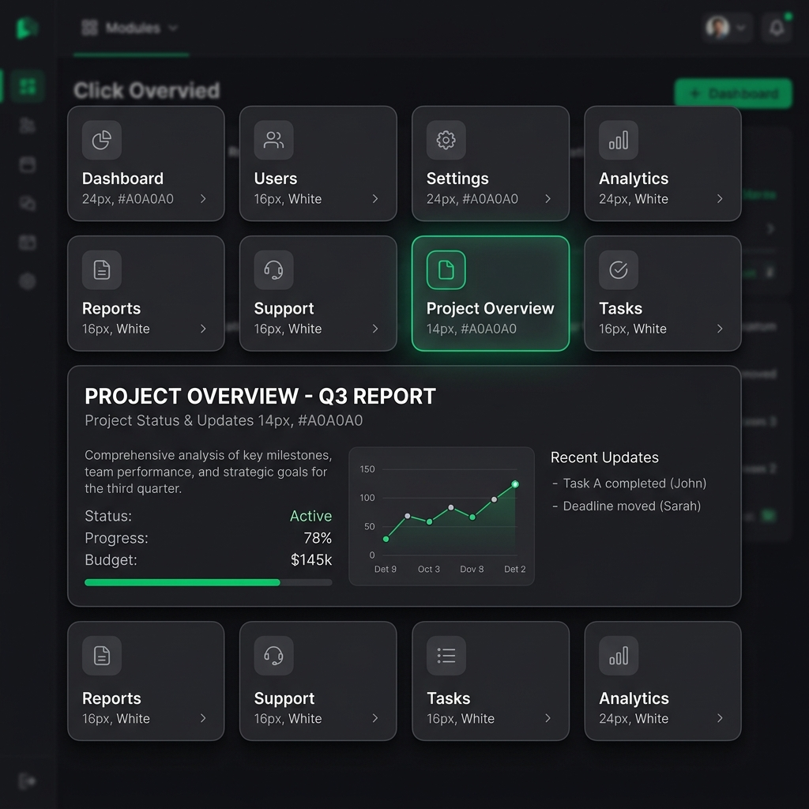

---

#### **ComparePanel**
Side-by-side "A vs B" comparisons with revealable state.

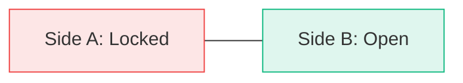

**Input Structure:**
```typescript
interface CompareSide {
  icon: string;
  title: string;
  revealContent?: string[]; // Bullet points shown on click
  color: string;
  border: string;
  locked?: boolean;
}
```

---

#### **ExpandableCardList**
Accordion-style cards that expand on click to reveal detail.

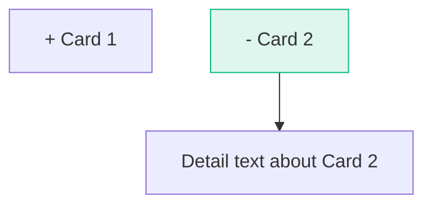

**Input Structure:**
```typescript
interface ExpandableCardItem {
  id: string;
  icon: string;
  label: string;
  reveal: string; // Text revealed on click
}
```

---

#### **CollapsibleTree**
A generic, animated tree structure for visualizing data or hierarchies.

```mermaid
graph TD
    Root --> C1[Child 1]
    Root --> C2[Child 2]
    C1 --> G1[Grandchild]
    style Root fill:#1e293b,stroke:#334155
```

**Input Structure:**
```typescript
interface TreeNode {
  label: string;
  icon?: string;
  children?: TreeNode[];
  expanded?: boolean;
}
```

---

#### **InfoCallout**
Contextual tips, warnings, and information highlights.

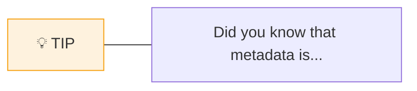

**Input Structure:**
```typescript
interface InfoCalloutConfig {
  text: string;
  icon?: string;
  variant?: 'info' | 'warning' | 'tip' | 'error';
}
```

---

#### **SimulatedTerminal**
An embedded, interactive shell for executing git or linux commands in a sandboxed VFS.

```mermaid
graph TD
    T[> git commit -m "init"]
    T --> O[ [main 12345] init ]
    style T fill:#000,stroke:#334155
```

**Input Structure:**
```typescript
interface SimulatedTerminalConfig {
  language: 'git' | 'linux';
  initialVfs?: Record<string, VfsNode>;
  preHistory?: string[]; // Commands to show as already run
}
```

---

#### **Multi**
The "Container of Containers". Stack multiple visualizations to create complex compound slides.

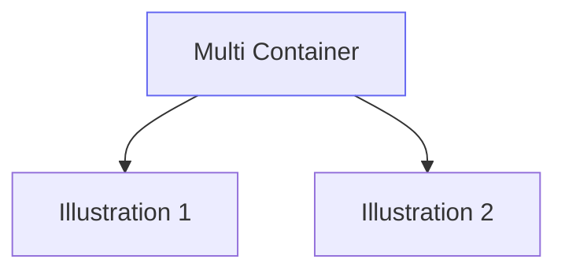

**Input Structure:**
```typescript
interface MultiConfig {
  illustrations: IllustrationConfig[];
  gap?: number; // Spacing between items
}
```

---

## 🛠 Complete Component Listing

| Type | Purpose | Configuration Key |
| :--- | :--- | :--- |
| `ExpandableCardList` | Accordion-style deep dives | `items`, `multiOpen` |
| `ComparePanel` | Side-by-side "A vs B" analysis | `left`, `right`, `successMessage` |
| `JourneyFlow` | Vertical roadmap / user journey | `steps`, `storeLabel` |
| `InteractiveBuckets` | Drag-and-drop categorization | `source`, `destination`, `items` |
| `CollapsibleTree` | Generic data tree visualization | `tree`, `indent`, `tip` |
| `InfoCallout` | Contextual tips and warnings | `text`, `icon`, `variant` |
| `Multi` | Vertically stacked illustrations | `illustrations`, `gap` |
| `SimulatedTerminal` | Embedded interactive shell | `language`, `initialVfs`, `preHistory` |

---

## 🚀 Development Workflow

To add a new visualization to the engine:

1. **Define the Props**: Add a new interface to `src/IllustrationConfig.ts`.
2. **Create the Component**: Build a new React component in `src/components/`.
3. **Register the Type**: Add the component to the `switch` statement in `renderIllustration.tsx`.
4. **Use it in Content**: Reference the new `type` in your `slide-configs.ts` files.

---

Designed with ❤️ for **StepWise**. Glitch-free, responsive, and visually stunning.
